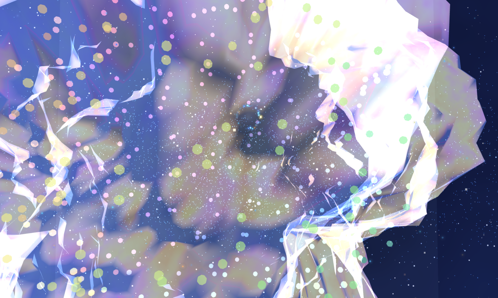

# 🌌 Hero Core v1

<p align="center">
  
</p>

<p align="center">
  <strong>Interactive Experience Engine</strong>
</p>

<p align="center">
  Universal Story • A Fibonacci Narrative
</p>

<p align="center">
  Creating cinematic, audio-reactive and interactive digital journeys.
</p>

<p align="center">
  
  
  
</p>

---

# 🚀 Live Experience

### Prototype

👉 https://prototype.thefridolin.com

---

# ✨ Vision

Most websites present information.

**Hero Core explores a different question:**

> What if a website could become an experience?

Instead of static content, Hero Core creates living digital environments driven by:

- 🌌 Visual Systems
- 🎧 Audio
- 🖱 Interaction
- 🎬 Narrative Progression

The goal is not to create effects.

The goal is to create experiences.

---

# 🌀 Universal Story

## A Fibonacci Narrative

Every Hero Core experience follows the same underlying journey:

```text
Observe
   ↓
Explore
   ↓
Transform
   ↓
Reveal
```

The Fibonacci sequence is not used as decoration.

It acts as a narrative structure for emergence, growth and transformation.

Every theme becomes a different expression of the same story.

---

# ⚡ Current Systems

| System | Status |
|----------|----------|
| 🌌 Space Theme | ✅ |
| 🎬 Movies Theme | ✅ |
| 🎧 Audio Engine | ✅ |
| 🌀 Fibonacci Presence | ✅ |
| ⚫ Gravity Field | ✅ |
| 🌊 Mouse Trail | ✅ |
| 🚀 Vercel Deployment | ✅ |

---

# 🏗 Architecture

```text
Universal Story
        │
        ▼
Narrative Fibonacci
        │
        ▼
Hero Core Engine
        │
 ┌──────┼──────┐
 ▼      ▼      ▼
Theme  Audio  Interaction
        │
        ▼
    Experience
```

---

# 🌌 Themes

## Space Theme

Procedural cosmic environments.

- Plasma Systems
- Nebula Structures
- Audio Reactivity
- Scroll Progression
- Cinematic Motion

## 🎬 Movies Theme

Visual storytelling through video.

- Multi-Layer Video System
- Dynamic Blending
- Audio Integration
- Narrative Presentation

## 🎨 DaVinci Theme

**Currently in Development**

The long-term vision of Hero Core.

Combining:

- Procedural Graphics
- Symbolic Systems
- Audio Interpretation
- Video
- Interaction

into a unified narrative experience.

---

# 🎧 Interaction Systems

### 🌀 Fibonacci Presence

A living procedural presence.

### ⚫ Gravity Field

A local gravitational influence system.

### 🌊 Mouse Trail

Atmospheric cinematic motion trails.

### 🎧 Audio Reactivity

Current Features:

- Audio Files
- Live Audio Input
- Frequency Analysis
- Energy Detection

Future Features:

- Beat Detection
- Event Systems
- Emotional Audio Mapping

---

# ⚙ Technical Stack

## Rendering

- Three.js
- WebGL
- GLSL
- Procedural Animation

## Audio

- Web Audio API
- Live Audio Input
- Frequency Analysis

## Engine

- Theme Manager
- State Manager
- Scroll Controller
- Audio Manager
- Interaction Manager

## Deployment

- Vite
- GitHub
- Vercel

---

# 🔮 Roadmap

## Foundation

- [x] Modular Engine Architecture
- [x] Theme System
- [x] Audio Pipeline
- [x] Interaction Framework

## Next

- [ ] Mobile Interaction Language
- [ ] Event-Based Audio Reactions
- [ ] Narrative Scroll Choreography
- [ ] Cinematic Experience Design

## Future

- [ ] Interactive Worlds
- [ ] DaVinci Theme
- [ ] Universal Story Framework

---

# 🎭 Philosophy

Hero Core is not a website template.

It is an exploration of how technology, sound, interaction, motion and storytelling can merge into a single experience.

> A Universal Story told through a Fibonacci Narrative.

---

# 👤 Author

**Erich Moenius**

Creative Technology • Interactive Experiences • Real-Time Graphics

🌐 https://thefridolin.com
